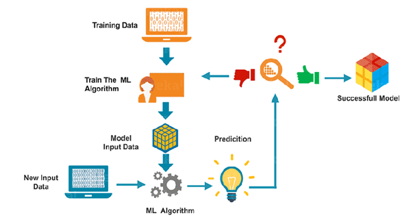

# Movie-Recommendation-System

# Software development life cycle (SDLC)
    •	Movie Data-set & data pre-processing
    •	Selecting features of the dataset
    •	Matrix of token counts of selected features
    •	Similarly Matrix
    •	Recommendation
    •	Application with code sample
    •	Evaluation

# Content-based filtering
Common approach when designing recommendation systems is content-based filtering. Content-based filtering methods are based on a description of the item and a profile of the user's preferences.These methods are best suited to situations where there is known data on an item (name, location, description, etc.), but not on the user. Content-based recommendations treat recommendation as a user-specific classification problem and learn a classifier for the user's likes and dislikes based on an item's features

The recommendation engine implemented in this repository aims to providing movie recommendation based on the many features of the movies. It recommends similar movie of selected movie to a user. Recommendation systems are widely used in today’s era of internet  searching for reliable and relevant information. While simple recommendation systems recommend users based on a few parameters, complex ones take many parameters into consideration. By implementing machine learning in recommendation systems.
